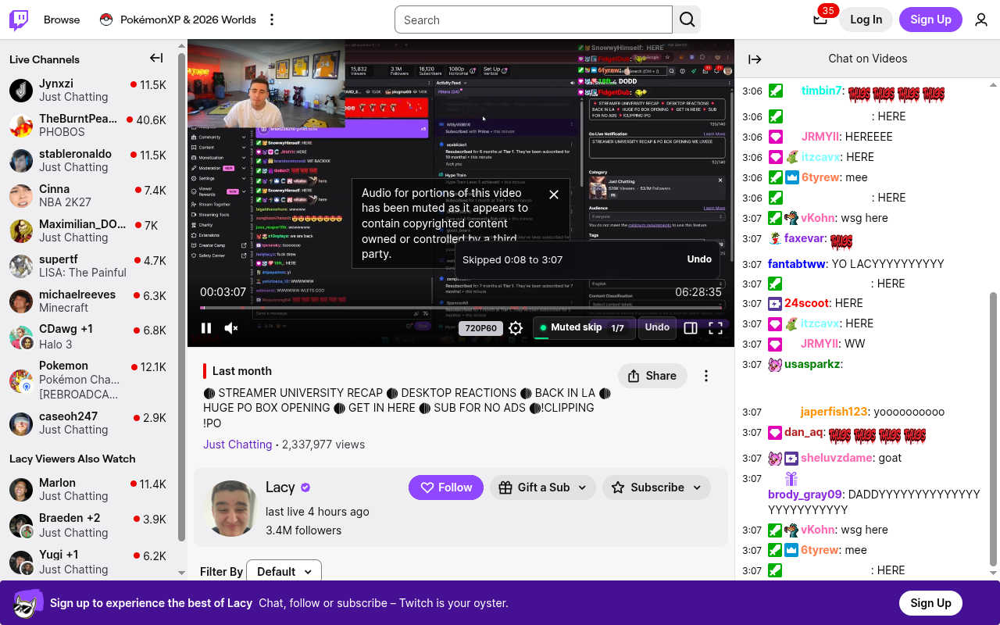

# SkipMute for Twitch

Browser extension for skipping Twitch VOD sections muted by Twitch Audio Recognition.

[](https://chromewebstore.google.com/detail/skipmute-for-twitch/joigloedgnkomhlekekfopbbeanlkcnp)
[](https://addons.mozilla.org/en-US/firefox/addon/skipmute-for-twitch/)



Works while logged out with no Client ID, token, or setup. By default, muted ranges are read from Twitch's player timeline and verified against playback audio locally in the page.

## Features

- Inline Twitch player control near the right-side player buttons.
- Automatic skip when playback reaches a detected muted segment.
- Progress badge showing muted segments passed over total muted segments.
- Undo after every automatic skip.
- Skip action after Undo so long muted sections can be re-skipped when the user is ready.
- Zero-setup, audio-confirmed timeline-marker detection.
- Optional official Twitch Helix API credentials.
- Automatic recovery when Twitch rebuilds its player controls.

## Browser Targets

- Firefox 142+ desktop: `manifest.json` uses Manifest V2 and Firefox's built-in data consent.
- Chrome 99+: `manifest.chrome.json` uses Manifest V3, which is required for Chrome publishing.

## Local Testing

### Firefox

1. Open `about:debugging#/runtime/this-firefox`.
2. Click **Load Temporary Add-on**.
3. Select `manifest.json`.
4. After edits, click **Reload** beside the temporary add-on and refresh the Twitch VOD tab.

### Chrome

1. Run `npm run package:chrome`.
2. Open `chrome://extensions`.
3. Enable Developer mode.
4. Click **Load unpacked**.
5. Select `dist/chrome`.

## Packaging

```sh
npm run check
npm run package:firefox
npm run package:chrome
```

Packaging requires Node.js 18+. It uses PowerShell on Windows and Python 3's standard library on macOS/Linux. No project dependencies are required.
CI also validates the packaged Firefox extension with Mozilla's pinned `web-ext` linter.

Outputs:

- `dist/twitch-vod-muted-skipper-firefox.zip`
- `dist/twitch-vod-muted-skipper-chrome.zip`

## Detection Sources

The extension tries detection in this order:

1. Official Twitch Helix API, if the user adds their own Client ID and OAuth bearer token.
2. Twitch player timeline markers, confirmed against the playing audio before SkipMute seeks.

Detection-source and credential changes apply to the open VOD without a page reload. API failures appear in the player control's tooltip.

## Privacy

See [PRIVACY.md](PRIVACY.md). The extension does not collect analytics, run remote code, or send data to non-Twitch services.

## Publishing Checklist

- Capture store screenshots listed in [STORE_LISTING.md](STORE_LISTING.md).
- Review permissions rationale in [STORE_LISTING.md](STORE_LISTING.md).
- Run `npm run check`.
- Package both browser builds.
- Enter a VOD through Twitch's client-side navigation and confirm the control appears.
- Test Skip, Undo, and Skip again on a VOD with visible red muted timeline markers.
